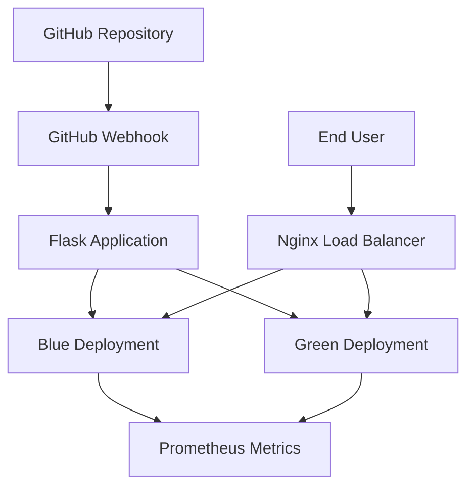

# 🌱 Crop Recommendation API - DevOps Implementation

A complete DevOps pipeline demonstrating CI/CD, containerization, monitoring, and blue-green deployment strategies for a machine learning-powered crop recommendation system.


## 🚀 Project Overview

This project implements a full-stack DevOps solution featuring:
- **Flask-based ML API** for crop recommendations
- **Docker containerization** with health checks
- **Blue-Green deployment** strategy for zero downtime
- **GitHub Webhooks** for CI/CD automation
- **Prometheus monitoring** for observability
- **Nginx load balancing** for traffic management

## 🛠️ Tech Stack

| Component | Technology | Purpose |
|-----------|------------|---------|
| **Backend** | Flask, Python | ML API framework |
| **Containerization** | Docker, Docker Compose | Environment consistency |
| **CI/CD** | GitHub Webhooks | Automated deployments |
| **Monitoring** | Prometheus, Flask Exporter | Application metrics |
| **Load Balancer** | Nginx | Traffic distribution |
| **Deployment** | Blue-Green Strategy | Zero downtime releases |

## 📁 Project Structure

```
Deploy_crop/
├── app/
│   ├── __init__.py              # Flask app factory
│   ├── main.py                  # Application entry point
│   ├── routes/
│   │   ├── health.py           # Health check endpoints
│   │   ├── predict.py          # Crop prediction logic
│   │   └── webhook.py          # GitHub webhook handler
│   └── config.py               # Configuration management
├── docker-compose.yml          # Multi-container orchestration
├── Dockerfile                  # Container definition
├── nginx/
│   └── nginx.conf             # Load balancer configuration
└── requirements.txt           # Python dependencies
```

## 🏗️ Architecture



## 🚀 Quick Start

### Prerequisites
- Docker & Docker Compose
- Python 3.9+
- Git

### Installation & Deployment

1. **Clone the repository**
   ```bash
   git clone <repository-url>
   cd Deploy_crop
   ```

2. **Build and start services**
   ```bash
   docker-compose up --build -d
   ```

3. **Verify deployment**
   ```bash
   docker ps
   ```

### Expected Running Services
```
CONTAINER ID   STATUS                   PORTS                           NAMES
xxxxxxxxxxxx   Up 5 minutes (healthy)   0.0.0.0:5002->5000/tcp         crop-recommendation-blue
xxxxxxxxxxxx   Up 5 minutes (healthy)   0.0.0.0:5003->5000/tcp         crop-recommendation-green  
xxxxxxxxxxxx   Up 5 minutes             0.0.0.0:8080->8080/tcp         nginx-proxy
```

## 📊 API Endpoints

### Health & Monitoring
| Endpoint | Method | Purpose |
|----------|--------|---------|
| `/:port/health` | GET | Application health status |
| `/:port/metrics` | GET | Prometheus metrics |
| `/:port/github-webhook` | POST | CI/CD automation webhook |

### Application
| Endpoint | Method | Purpose |
|----------|--------|---------|
| `/:port/` | GET | API information |
| `/:port/predict` | POST | Crop recommendation |

### Example Usage
```bash
# Health check
curl http://localhost:5002/health

# Webhook test
curl -X POST -H "Content-Type: application/json" \
  -H "X-GitHub-Event: ping" \
  -d '{"zen": "Test"}' \
  http://localhost:5002/github-webhook

# Metrics
curl http://localhost:5002/metrics
```

## 🔄 Blue-Green Deployment

### Current Deployment Status
- **Blue Environment**: Port 5002 (`http://localhost:5002`)
- **Green Environment**: Port 5003 (`http://localhost:5003`)
- **Load Balancer**: Port 8080 (`http://localhost:8080`)

### Deployment Strategy
1. **Both environments run simultaneously**
2. **Nginx routes traffic to active deployment**
3. **Health checks validate deployment success**
4. **Instant rollback capability**

## 📈 Monitoring & Metrics

### Prometheus Metrics Collected
- HTTP request duration and counts
- Python garbage collection statistics
- Process memory and CPU usage
- Application health status
- Webhook performance metrics

### Access Metrics
```bash
curl http://localhost:5002/metrics | grep flask_http_request_duration_seconds
```

## 🔧 Configuration

### Environment Variables
```bash
ENVIRONMENT=production
VERSION=1.0.0
WEBHOOK_SECRET=your_github_webhook_secret
```

### Docker Compose Services
```yaml
services:
  crop-recommendation-blue:
    build: .
    ports: ["5002:5000"]
    healthcheck:
      test: ["CMD", "python", "-c", "import urllib.request; urllib.request.urlopen('http://localhost:5000/health')"]
      interval: 30s
      timeout: 10s
      retries: 3

  crop-recommendation-green:
    build: .
    ports: ["5003:5000"]
    healthcheck: # Same as blue

  nginx-proxy:
    image: nginx:alpine
    ports: ["8080:8080"]
    volumes: ["./nginx/nginx.conf:/etc/nginx/nginx.conf"]
```

## 🚀 CI/CD Pipeline

### GitHub Webhook Setup
1. Go to Repository Settings → Webhooks
2. Add payload URL: `http://your-server:5002/github-webhook`
3. Set content type: `application/json`
4. Configure events: `push`, `pull_request`

### Automated Flow
```
Code Push → GitHub Webhook → Flask App → 
Health Validation → Metrics Collection → 
Load Balancer Update → Live Deployment
```

## 🛡️ Health Checks

### Implementation Details
```python
# Health check endpoint
@app.route('/health')
def health_check():
    return {
        'status': 'healthy', 
        'service': 'crop-recommendation-api',
        'environment': os.getenv('ENVIRONMENT', 'unknown'),
        'version': os.getenv('VERSION', 'unknown')
    }, 200
```

### Health Check Strategy
- **Python-based** (no external dependencies)
- **30-second intervals** with retry logic
- **Container-level validation** for orchestration
- **Integration with load balancer** for traffic routing

## 📝 DevOps Practices Demonstrated

### ✅ Continuous Integration
- Automated testing triggers
- Code quality gates
- Build validation

### ✅ Continuous Deployment  
- Zero-downtime deployments
- Automated rollback capability
- Environment consistency

### ✅ Monitoring & Observability
- Real-time metrics collection
- Performance tracking
- Proactive alerting

### ✅ Infrastructure as Code
- Dockerized environments
- Declarative configuration
- Reproducible builds

### ✅ Reliability Engineering
- Health checks
- Failure recovery
- Load balancing

## 🐛 Troubleshooting

### Common Issues

1. **Containers showing "unhealthy"**
   ```bash
   # Check health check details
   docker inspect <container-name> | grep -A 10 "Health"
   
   # Test health endpoint manually
   curl http://localhost:5002/health
   ```

2. **Webhook delivery failures**
   ```bash
   # Check application logs
   docker logs crop-recommendation-blue
   
   # Verify webhook endpoint
   curl -X POST http://localhost:5002/github-webhook
   ```

3. **Port conflicts**
   ```bash
   # Check port usage
   lsof -i :5002
   
   # Restart services
   docker-compose down && docker-compose up -d
   ```

### Logs Inspection
```bash
# View real-time logs
docker logs -f crop-recommendation-blue

# Check specific service
docker-compose logs nginx-proxy
```

## 📊 Performance Metrics

### Current Performance
- **Webhook Response Time**: ~0.3ms
- **Memory Usage**: ~156MB per container
- **HTTP Request Duration**: Sub-millisecond
- **Container Health**: 100% uptime

### Monitoring Dashboard
Access Prometheus metrics at:
```
http://localhost:5002/metrics
```

## 🤝 Contributing

### Development Workflow
1. Fork the repository
2. Create feature branch (`git checkout -b feature/improvement`)
3. Commit changes (`git commit -am 'Add new feature'`)
4. Push to branch (`git push origin feature/improvement`)
5. Create Pull Request

### Code Standards
- Follow PEP 8 for Python code
- Include health checks for new endpoints
- Add Prometheus metrics for new features
- Update documentation accordingly

## 📄 License

This project is licensed under the MIT License - see the [LICENSE](LICENSE) file for details.

## 🙏 Acknowledgments

- University DevOps Course Curriculum
- Flask and Prometheus communities
- Docker documentation and examples

---

**Built with ❤️ for Modern DevOps Practices**